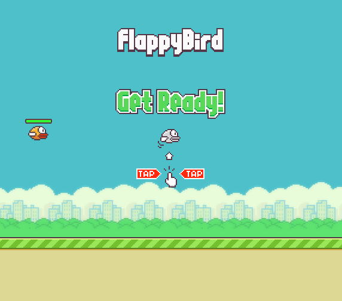
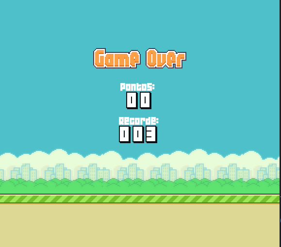

<h1 align="center">FlappyBird-LOVE2D </h1>

🚀 Game developed with Lua Programming Language using Love2D framework

<h4 align="center"> 
	🚧  In Development:::Building...  🚧
</h4>

<h1 align="center">
  
</h1>

<h1 align="center">
  
</h1>
